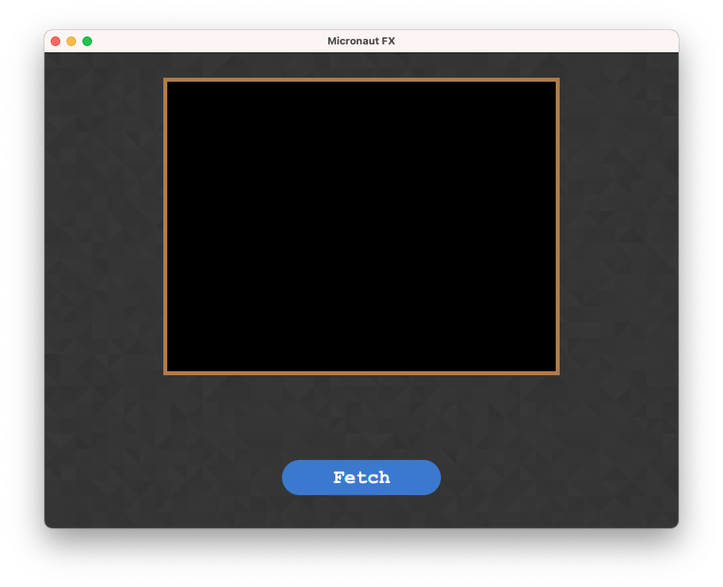
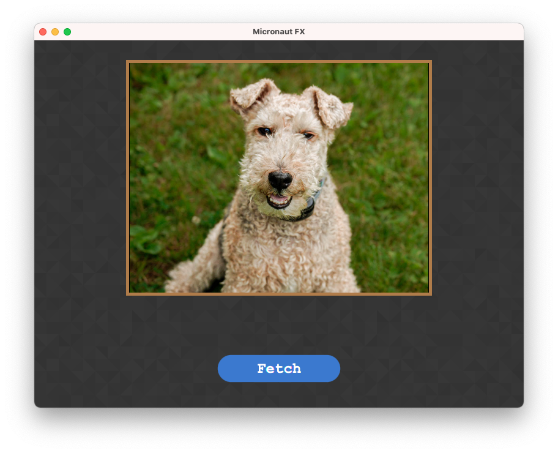

## Micronaut FX - Micronaut + Java FX demo

A sample project using [micronaut](https://micronaut.io) and [Gluon Ignite](https://github.com/gluonhq/ignite) integration to build [Java FX](https://openjfx.io/) applications.

### Running
Via command line `./gradlew run`.

Inside IDE follow the docs on setting up JavaFX on [non-modular IDE](https://openjfx.io/openjfx-docs/) project.

## Screenshots

